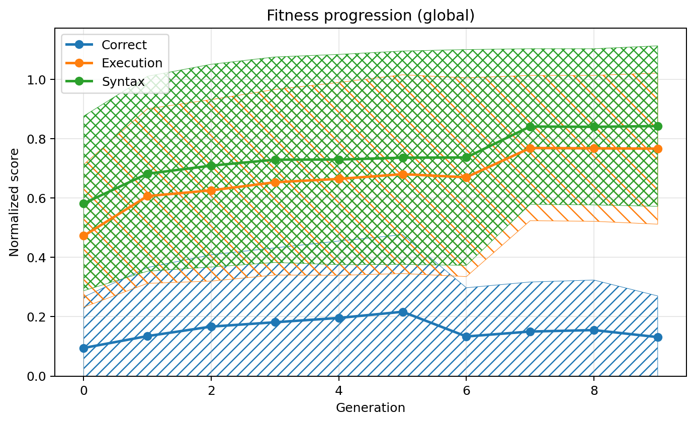
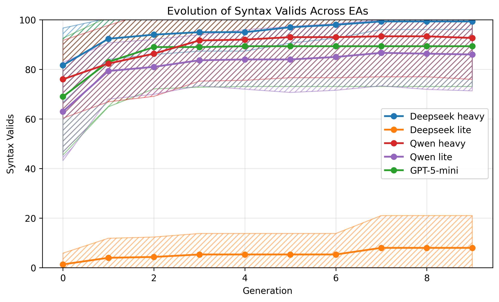
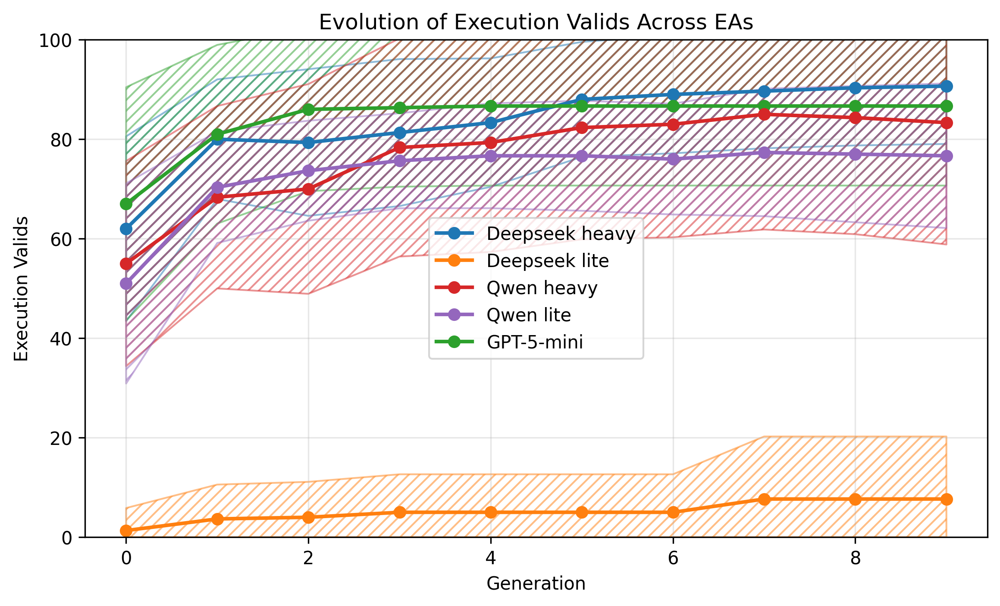
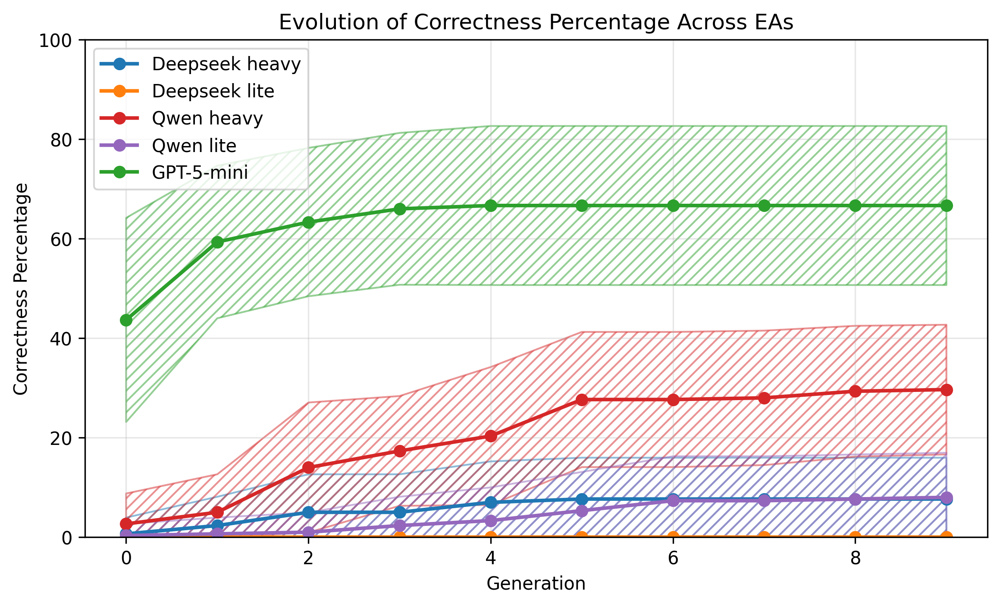
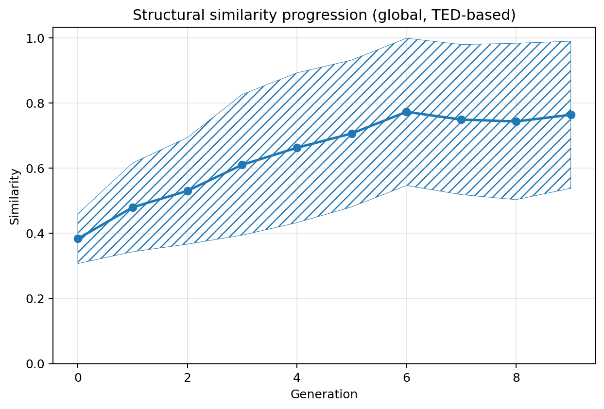
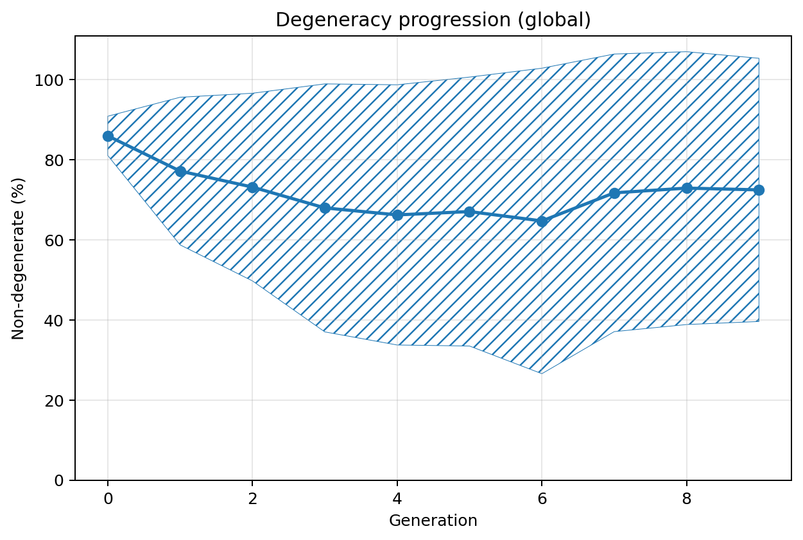
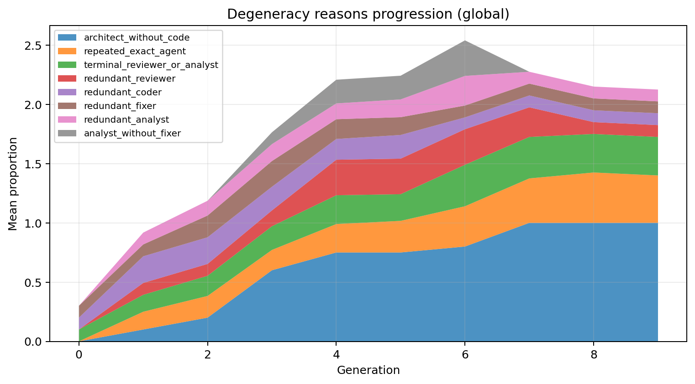
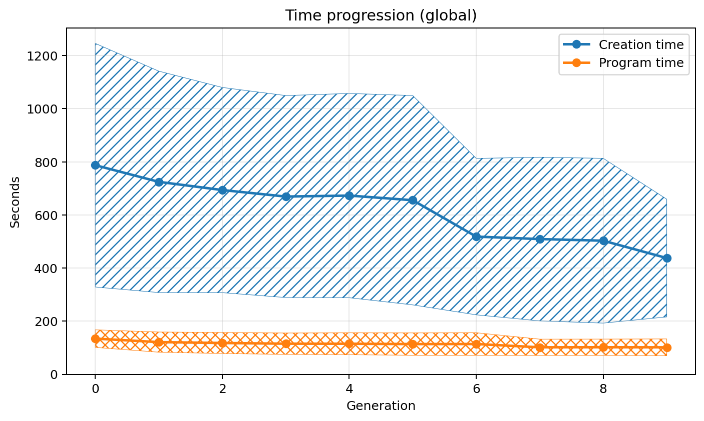
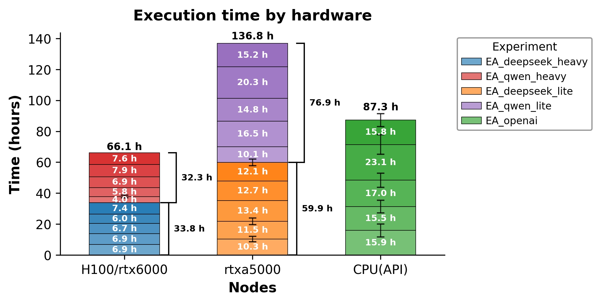

# LLM-MAS Design via Grammar-Based Evolutionary Approach

Official companion repository for the paper:

> **Design of LLM-based Multi-Agent Systems for Automatic Code Generation: A Grammar-Based Evolutionary Approach**

This repository contains all resources needed to reproduce the experiments, inspect the methodology, and build upon the presented work.

---

## Table of Contents

- [Overview](#overview)
- [Key Concepts](#key-concepts)
- [Methodology](#methodology)
- [Repository Structure](#repository-structure)
- [Requirements & Setup](#requirements--setup)
- [Experimental Results](#experimental-results)
  - [Fitness Progression](#fitness-progression)
  - [Code Quality Metrics](#code-quality-metrics)
  - [Population Dynamics](#population-dynamics)
  - [Runtime Analysis](#runtime-analysis)
- [Citation](#citation)
- [License](#license)

---

## Overview

Recent advances in large language models (LLMs) have opened new possibilities for automating software engineering tasks. This paper proposes a **grammar-guided evolutionary approach** to automatically design LLM-based multi-agent systems (MAS) tailored for code generation.

The core idea is to encode the entire architectural design space—agent roles, prompt strategies, communication topologies, and voting/aggregation mechanisms—as a **context-free grammar (CFG)**. A genetic programming algorithm then explores this space, discovering effective agent configurations without manual engineering.

**Key contributions:**
- A formal grammar that captures the design space of LLM-based MAS for code generation.
- A grammar-guided genetic programming (GGP) algorithm for automated MAS design.
- Empirical evaluation of the evolved architectures on standard code generation benchmarks.
- Analysis of evolutionary dynamics, degeneracy, and population diversity.

---

## Key Concepts

### LLM-based Multi-Agent Systems (MAS)
A multi-agent system in this context is a pipeline of LLM-powered agents that collaborate to solve a programming task. Each agent may have a distinct role (e.g., *coder*, *critic*, *tester*, *ranker*) and communicates with other agents through structured messages.

### Context-Free Grammar (CFG) as Design Space
The grammar defines what constitutes a valid MAS configuration. Non-terminals represent abstract components (e.g., `<pipeline>`, `<agent>`, `<prompt_strategy>`), while terminals are concrete choices (e.g., specific prompt templates, model names, aggregation rules). Any derivation from the start symbol yields a fully specified, executable MAS.

### Grammar-Guided Genetic Programming (GGP)
The evolutionary algorithm operates on derivation trees produced by the grammar:
- **Initialisation** — random valid derivations generate the initial population of MAS configurations.
- **Fitness evaluation** — each individual (MAS) is executed on benchmark tasks and scored by correctness metrics.
- **Selection** — fitter individuals are preferentially chosen for reproduction.
- **Crossover** — subtrees from two parent derivation trees are exchanged at compatible non-terminal nodes.
- **Mutation** — random subtrees are re-derived from the grammar to introduce variation.

---

## Methodology

The overall pipeline is illustrated below at a high level:

1. **Grammar definition** — encode MAS design choices as a CFG stored in [`data/`](data/).
2. **Population initialisation** — derive a population of MAS configurations from the grammar.
3. **Benchmark evaluation** — run each MAS on the target programming benchmarks and record pass rates, syntax validity, and execution validity.
4. **Evolutionary loop** — iterate selection → crossover → mutation until a stopping criterion is met.
5. **Analysis** — inspect fitness curves, diversity metrics, degeneracy, and runtime to understand the search dynamics.

---

## Repository Structure

```
.
├── code/           # Source code: evolutionary algorithm, MAS framework, evaluation scripts
├── data/           # Benchmarks, grammar definitions, experimental results
├── visual_info/    # Figures and plots produced during / after experiments
└── README.md       # This file
```

| Directory | Description |
|-----------|-------------|
| [`code/`](code/) | Grammar-guided GGP implementation, MAS execution framework, evaluation scripts, and utility helpers. |
| [`data/`](data/) | Programming benchmarks (e.g., HumanEval, MBPP), CFG files defining the design space, and raw/processed experimental outputs. |
| [`visual_info/`](visual_info/) | All figures, charts, and interactive HTML visualisations generated from experimental runs. |

---

## Requirements & Setup

Python **≥ 3.10** is recommended. Install dependencies with:

```bash
pip install -r requirements.txt
```

Refer to the docstrings of individual modules in [`code/`](code/) and the paper for a detailed description of the experimental protocol.

---

## Experimental Results

The figures below summarise the main experimental findings. All source images are available in [`visual_info/`](visual_info/).

---

### Fitness Progression

The plot below shows how the best and average fitness (fraction of benchmark tasks solved correctly) evolves across generations over all evolutionary runs.



---

### Code Quality Metrics

The following three plots track the fraction of individuals whose generated code is (i) syntactically valid, (ii) executes without error, and (iii) produces the correct answer, respectively.

**Syntax validity evolution**



**Execution validity evolution**



**Correct answers evolution**



---

### Population Dynamics

**Similarity progression** — measures the average pairwise similarity between individuals in the population, indicating convergence vs. diversity.



**Degeneracy progression** — tracks the proportion of degenerate (non-viable) individuals over time.



**Degeneracy reasons** — breaks down the causes of degeneracy (e.g., grammar violations, runtime errors) observed globally.



**Time per generation** — wall-clock time consumed by each generation of the evolutionary loop.



---

### Runtime Analysis

Runtime comparison across different hardware configurations used during the experiments.



---

## Citation

If you use this repository in your research, please cite the companion paper (full reference to be added upon publication).

---

## License

Please refer to the `LICENSE` file for terms of use. If no license file is present, all rights are reserved by the authors.
